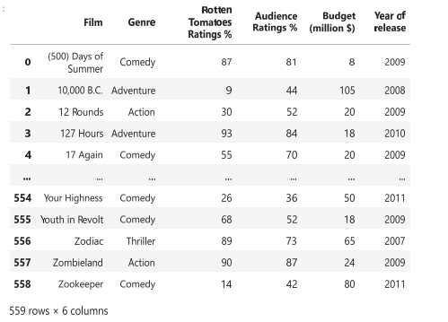
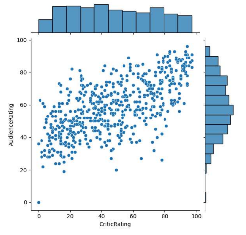
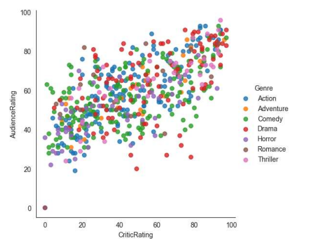
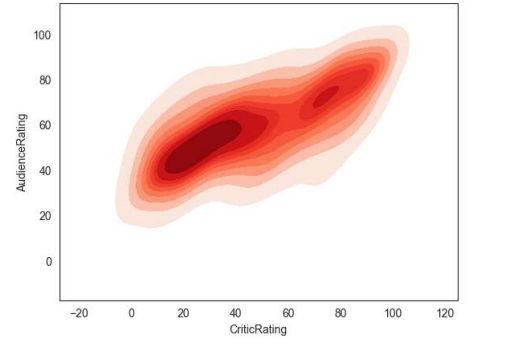
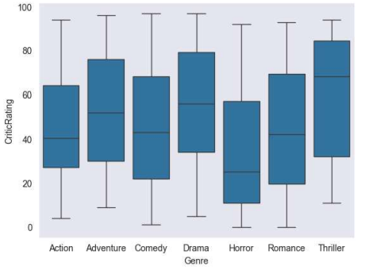
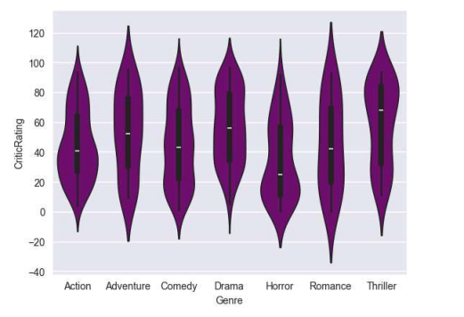
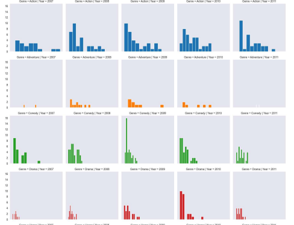

# 📊 Data Visualization Project  
_A practical exploration of visual analytics using Matplotlib & Seaborn_

This project is part of my Data Science Course, where I focused on understanding how visualizations can reveal patterns, trends, and hidden insights in data.  
Using Python’s powerful visualization libraries, I created a wide range of plots to analyze datasets, improve interpretability, and enhance data storytelling.

---

## 🚀 Project Overview

This project demonstrates my ability to:

- Use **Matplotlib** and **Seaborn** to create professional-quality visualizations  
- Perform **Exploratory Data Analysis (EDA)** through statistical plots  
- Represent data using heatmaps, scatter plots, distribution plots, and more  
- Customize visuals using themes, color palettes, annotations, and styling  
- Break down complex data into intuitive visual insights

---

## 🛠️ Technologies Used

- **Python 3.14**
- **Matplotlib**
- **Seaborn**
- **Pandas**
- **NumPy**
- **Jupyter Notebook**

---
## 📸 Visualization Gallery

Some screenshots of the plots created in this project.

---

### **1️⃣ Dataset Preview**  
A glimpse of the dataset used for visual analysis.



---

### **2️⃣ Joint Plot**  
Shows the relationship between two variables along with their individual distributions.



---

### **3️⃣ Distplot**  
Displays the distribution of a numerical feature, useful for understanding frequency patterns.


---

### **4️⃣ Scatter Plot**  
Visualizes correlations or patterns between two continuous variables.



---

### **5️⃣ KDE Plot**  
A Kernel Density Estimate plot that smooths the data distribution for better pattern visibility.



---

### **6️⃣ Box Plot**  
Summarizes data distribution through quartiles and highlights outliers effectively.



---

### **7️⃣ Violin Plot**  
Combines KDE and boxplot elements to represent the density and spread of the data.



---

### **8️⃣ Facet Grid**  
Displays multiple plots split across different categories, helping compare patterns.




## 📘 How to Run the Project

1. Clone this repository:
   ```bash
   git clone https://github.com/MohammedAwan/DataScience-AI-ML-GenAI-/tree/main/Data%20Visualization

